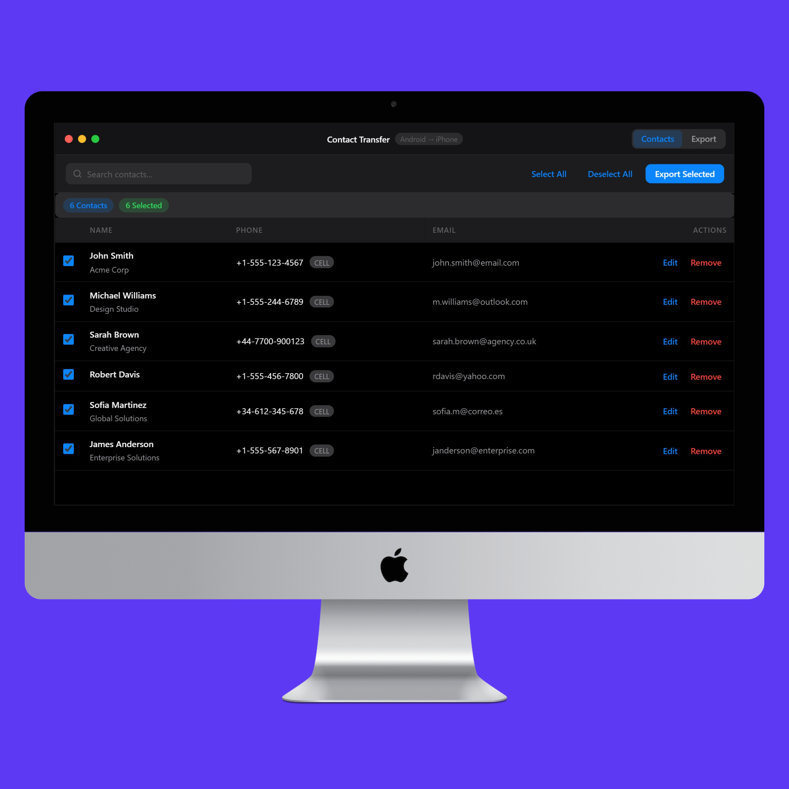
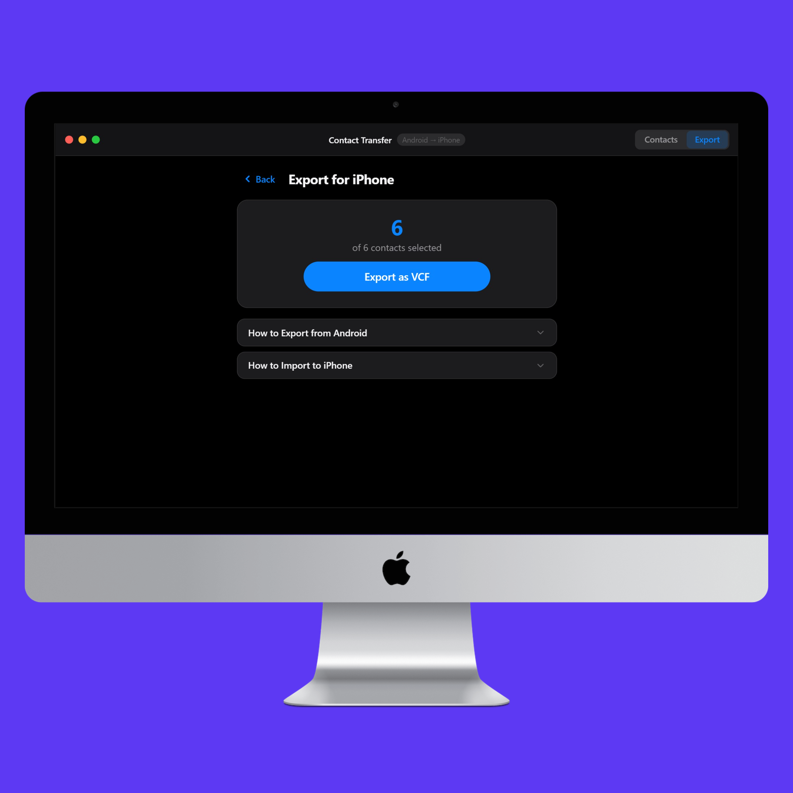

# Contact Transfer

Desktop app for transferring contacts between Android and iPhone using VCF files. No cloud, no accounts, everything is done locally on your computer.


## How it works

1. Choose your transfer direction (Android to iPhone or iPhone to Android)
2. Load your `.vcf` file by browsing or drag and drop
3. Review your contacts, edit or remove the ones you don't want
4. Export to a new VCF ready to import on your phone





## Download

Head over to [Releases](https://github.com/alexandrosnt/contact-transfer/releases) and grab the latest version.

Works on Windows, macOS and Linux.

## Build from source

```bash
git clone https://github.com/alexandrosnt/contact-transfer.git
cd contact-transfer
npm install
npm run build
```

Output goes in the `dist` folder.

## License

[Apache 2.0](LICENSE)
